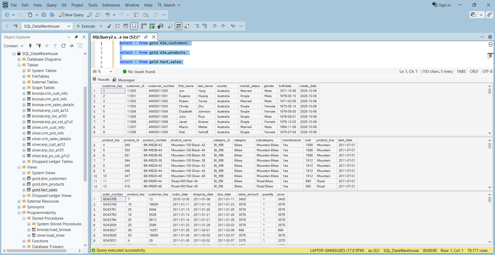

<div align="center">

# 🚀 CRM-ERP Data Warehousing and Business Intelligence

<p>
  
  &nbsp;
  
  &nbsp;
  
  &nbsp;
  
</p>

</div>

## 📌 Project Overview
This project integrates CRM and ERP source data into a centralized SQL Server data warehouse using Medallion Architecture (Bronze, Silver, and Gold layers) for analytics and reporting. It covers end-to-end ETL pipelines in T-SQL, analytical data modeling with fact and dimension structures, and Power BI reporting built on SQL Gold-layer views to generate actionable business insights.

---

## 📋 Project Requirements

### 🏗️ Building the Data Warehouse (Data Engineering)
- **Objective:** Develop a modern data warehouse using SQL Server to consolidate sales data, enabling analytical reporting and informed decision-making.
- **Data Sources:** Import data from two source systems (ERP and CRM) provided as CSV files.
- **Data Quality:** Cleanse and resolve data quality issues prior to analysis.
- **Integration:** Combine both sources into a single, user-friendly data model designed for analytical queries.
- **SCD Approach:** Uses an SCD Type 1 style current-state model with no historization.
- **Documentation:** Provide clear documentation of the data model to support both business stakeholders and analytics teams.

---
## 🏗️ Data Architecture

The data architecture for this project follows Medallion Architecture **Bronze**, **Silver**, and **Gold** layers:


### 1. Bronze Layer (Raw Ingestion)
- **Method:** Uses high-performance `BULK INSERT` operations to mirror raw CSV files.
- **Purpose:** Provides a full-refresh raw snapshot of source data, enabling straightforward reconciliation with source files.

### 2. Silver Layer (Transformation & Cleansing)
- **Data Cleansing:** Uses string functions (`TRIM`, `REPLACE`, `SUBSTRING`) to sanitize inputs.
- **Normalization:** Converts raw system codes into business-friendly values (for example gender and country mappings).
- **Deduplication:** Uses `ROW_NUMBER()` with `PARTITION BY` to ensure a unique current record per entity.
- **Derived Intelligence:** Implements sales correction logic and product validity window derivation using window functions such as `LEAD()`.

### 3. Gold Layer (Presentation & Star Schema)
- **Modeling:** Transformed into a clean **Star Schema**.
- **Dimensions:** `dim_customers` and `dim_products` act as descriptive hubs for analytical exploration.
- **Fact:** `fact_sales` serves as the central granular transaction repository, ready for reporting in Power BI.

The SQL object view below shows the Gold layer star schema, with fact_sales linked to the customer and product dimensions.



---

## 📂 Project Structure

```text
├── Images/               # Project diagrams and documentation assets
├── datasets/             # Source data (CRM and ERP CSV files)
├── scripts/              # Modular SQL scripts
│   ├── bronze/           # DDL and ETL load procedures
│   ├── silver/           # Cleansing logic and data normalization
│   ├── gold/             # Star schema view definitions
│   └── init_database.sql # Database environment provisioning
├── tests/                # SQL-based quality assurance scripts
├── .gitignore            # Git exclusion rules
├── README.md             # Project documentation
└── sales_analysis.pbix   # Business intelligence reporting
```

---

## ⚡ Technical Highlights & QA

- **Robust ETL Patterns:** Procedures use `TRY...CATCH` blocks and execution logging, capturing `ERROR_MESSAGE()`, `ERROR_NUMBER()`, and `ERROR_STATE()` for fail-safe operations.
- **Quality Assurance Coverage:** Dedicated SQL quality-check scripts are used to validate data integrity and consistency after layer loads.
- **Performance:** `TABLOCK` is used during ingestion to improve bulk-load efficiency and reduce logging overhead.

---

## 🚀 Tech Stack

- **DBMS:** Microsoft SQL Server
- **Language:** T-SQL (Stored Procedures, DDL, DML, Views)
- **Design Pattern:** Medallion Architecture (Bronze-Silver-Gold)
- **BI Tooling:** Power BI
- **Data Source Format:** CSV flat files

---

## 🧭 Naming Standards
Naming conventions are documented in:
- `docs/naming_conventions.md`

Highlights:
- Snake case for object and column names
- Layer-based table naming (`bronze.*`, `silver.*`, `gold.*`)
- Surrogate keys use `_key` suffix
- Technical metadata columns use `dwh_` prefix

---

## ✅ Data Quality Validation
After loading Silver and Gold, run:
- `tests/quality_checks_silver.sql`
- `tests/quality_checks_gold.sql`

Expected behavior:
- Duplicate or null key checks should return no rows.
- Referential integrity checks between fact and dimensions should return no rows.
- Standardization checks should show normalized values.

---

## 📊 Power BI Dashboard

Interactive Power BI dashboard connected to SQL Server Gold layer views for comprehensive sales analysis and business intelligence.

To support time intelligence calculations, I created a Date Dimension in Power Query before building the Power BI report.


The model view below shows the Star Schema design connecting the fact table to the customer, product, and date dimensions, with a dedicated _Measures table to centralize business logic and improve maintainability.


The dashboard screenshot below shows the final Power BI report built on top of that model.


**Dashboard Highlights:**

1. **Sales Performance Metrics** - Real-time KPI cards displaying total sales amount, total orders, customer count, product inventory, and total quantity sold metrics for comprehensive business overview
2. **Sales Trends & Analysis** - Interactive line chart tracking sales performance over time with granular breakdown by product categories and product lines to identify trends and patterns
3. **Geographic & Demographic Insights** - World map visualization for geographic sales distribution, and demographic segmentation charts for customer gender and marital status distributions
4. **Top Performers** - Detailed ranking tables showcasing top-performing products and high-value customers with sales amounts and transaction metrics for focused analysis
5. **Interactive Filtering** - Comprehensive set of dynamic slicers allowing filtering by temporal range, geography, customer demographics, and product dimensions with real-time cross-filtering across all visualizations

